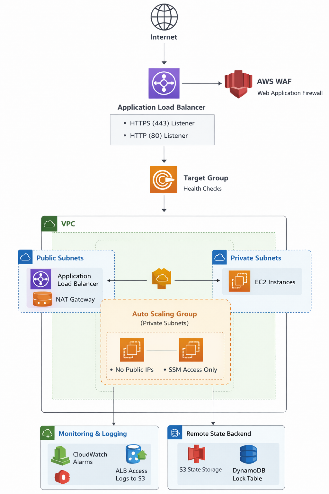
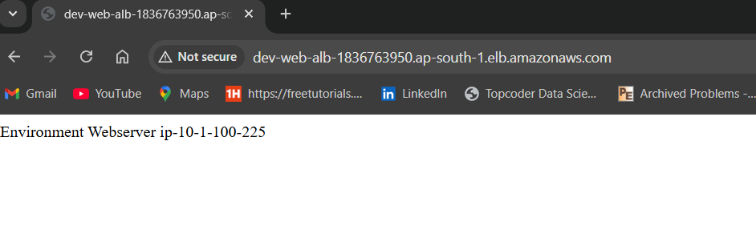
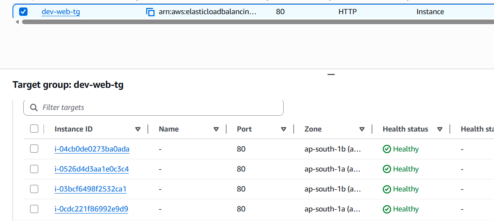

# Production-Grade Infrastructure using Terraform (Workspace-Based)

------------------------------------------------------------------------

## Architecture Overview

This project provisions a highly available, secure, and scalable AWS
infrastructure using modular Terraform and workspace-based environment
separation.

### High Level Architecture

-------------------------------------------------

                    Internet
                        │
                        ▼
               AWS WAF (Web ACL)
                        │
                        ▼
            Application Load Balancer
            (Public Subnets, Multi-AZ)
                        │
                        ▼
                  Target Group
                        │
                        ▼
               Auto Scaling Group 
                        │
                        ▼
                EC2 Web Instances
                  (No Public IP)

-------------------------------------------------
VPC (Multi-AZ)
  - Public Subnets (ALB, NAT Gateway)
  - Private Subnets (EC2 Instances)

Observability:
  - CloudWatch Alarms
  - ALB Access Logs → S3

Remote State:
  - S3 (versioned, encrypted)
  - DynamoDB (state locking)


### Architecture Diagram

------------------------------------------------------------------------



------------------------------------------------------------------------

## Workspace-Based Environment Strategy

Terraform workspaces represent environments:
-   dev
-   prod

------------------------------------------------------------------------

## Setup & Deployment

### Prerequisites

-   Terraform \>= 1.5
-   AWS CLI configured
-   IAM permissions

### 1. Bootstrap Backend

```
cd bootstrap
terraform init
terraform apply
```

### 2. Initialize Infrastructure

```
terraform init
```

### 3. Create Workspace

Dev:

```
terraform workspace new dev 
terraform workspace select dev 
terraform apply -var-file="environments/dev.tfvars"
```

Prod:

```
terraform workspace new prod
terraform workspace select prod
terraform apply -var-file="environments/prod.tfvars"
```
------------------------------------------------------------------------

## CI/CD -- GitHub Actions

We utilize a **Multi-Branch Pipeline** strategy to ensure code quality and environment isolation.


### Pipeline Flow:
1.  **Static Analysis:** Runs `terraform fmt` and `terraform validate` on every push.
2.  **Environment Isolation:** Uses Terraform **Workspaces** to separate `dev` and `prod` state files.
3.  **Branch Logic:**
    * **Dev Branch:** Automatic `plan` and `apply` for rapid iteration.
    * **Prod (Tags):** Deployment to production is triggered only when a version tag (`v*`) is pushed, ensuring a controlled release cycle.

------------------------------------------------------------------------

## Assumptions & Trade-offs

Assumptions: - Single AWS region - Stateless application - NAT single-AZ
(cost optimization)

Trade-offs: - Workspace separation vs folder isolation - HTTP only (no
TLS) - No cross-region DR

------------------------------------------------------------------------

## Clean Destroy

```
terraform workspace select dev
terraform destroy
terraform workspace select prod
terraform destroy
```

Optional backend:

```
cd bootstrap
terraform destroy
```

------------------------------------------------------------------------

## Proofs Successfully Deployed 

### ALB Response



### Health-Check Passed 



### GitHub Action Pipeline Ran Successfully


## Ops Notes

### Zero-Downtime Deployments

-   Launch Template versioning
-   ASG Instance Refresh
-   ALB connection draining
-   Rolling updates
-   Blue/Green strategy

### Monitoring

Infrastructure: - CPU utilization - Memory (CloudWatch Agent) - Disk
usage - ASG scaling events

Application: - HTTP 5xx errors - TargetResponseTime - UnHealthyHostCount

Security: - WAF blocked requests - IAM changes (CloudTrail)

Logging: - ALB access logs - EC2 logs

------------------------------------------------------------------------